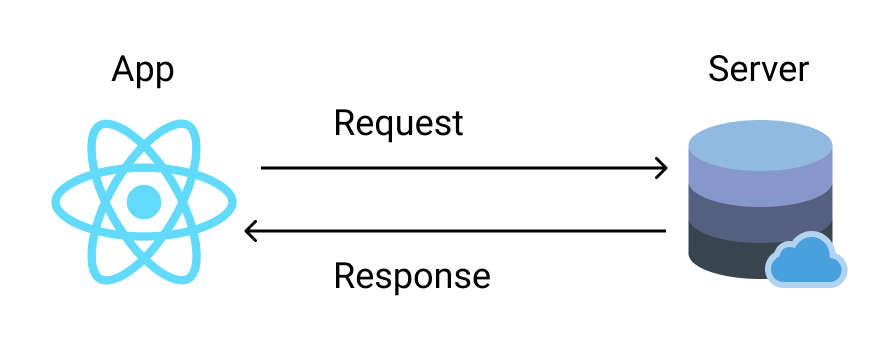
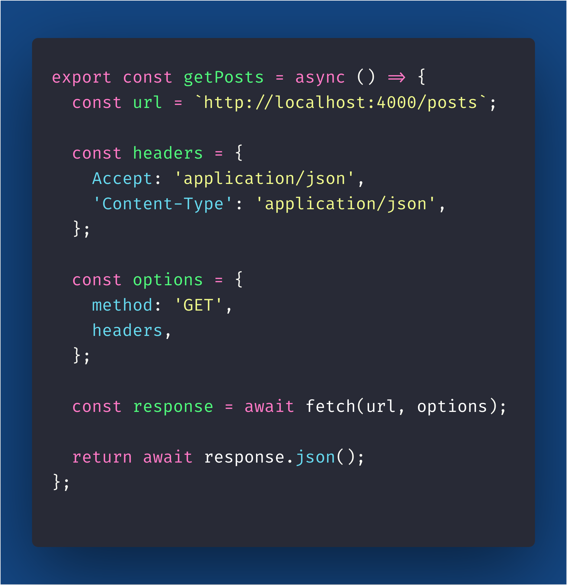
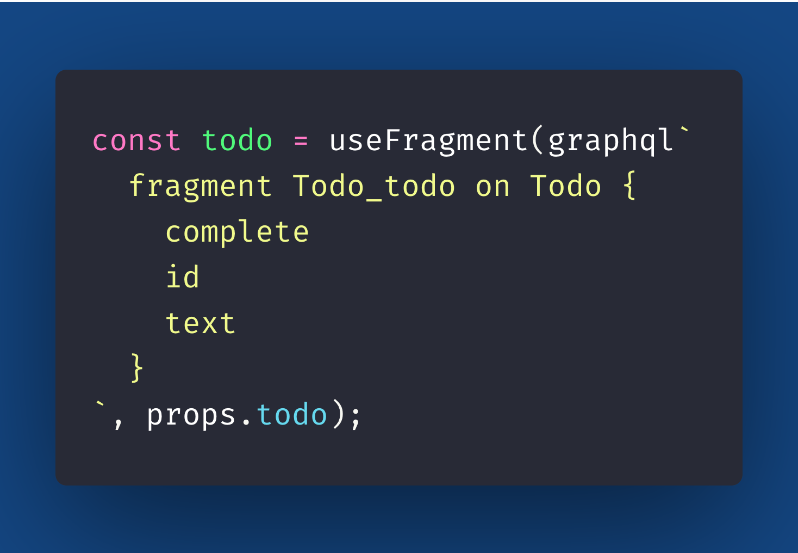

import { Head, Image, Appear } from 'mdx-deck'
import { Split, FullScreenCode } from 'mdx-deck/layouts'
import { CodeSurfer } from "mdx-deck-code-surfer";

import { Cover } from './Cover';
import { Intro } from './Intro';
import { Img } from './Img';
import { InlineImg } from './InlineImg';
import { Thanks } from './Thanks';
import { Feedback } from './Feedback';

export { default as theme } from './theme'

<Head>
  <title>Taming Data Fetching</title>
</Head>

<Cover />

---

<Intro />

---

## Overview

<ul>
    <Appear>
        <li>
            Motivation
        </li>
        <li>
            History/Evolution
        </li>
    </Appear>
</ul>

---

## Motivation

- What is Data Fetching?
- Why we need Data Fetching?
- Why is it hard?

---

## What is Data Fetching?

- It is the reading/retrieve of data from somewhere
- You can fetch data from local storage (disk) or network storage (server)

---

## Network Data Fetching Example

---

## Why we need Data Fetching?

- We can't keep all app data in memory
- We can't download all app user data locally
- We just want to fetch data we going to need

---

## Why is it hard?

- We don't want to overfetch (bring more data that we need)
- We don't want to underfetch (bring less data that we need)
---

## Why is it hard?

- We need to know from where we can get the data we need
- We can have more then one "endpoint" to get the data
- We want to cache data already fetched, so we don't waste network usage
---

## Imperative Data Fetching

- You define step by step how to do the data fetching logic
- You define the endpoints
- You define how to cache/store the data
- You define how to invalidate stale data
- You define when to do data fetching

---

## Imperative Data Fetching

---

## Declarative Data Fetching

- You define the data which components needs
- Relay/Apollo makes sure the data is ready when rendering the components

---

## Declarative Data Fetching

---

## History/Evolution

- componentDidMount
- useEffect hook
- Redux Thunk
- Redux Saga
- Relay HOCs
- Suspense
- Relay hooks + Suspense

---

## Request Waterfall

- You first fetch code (code split),
- then you fetch data

---

## Fetch Policy

- fetch then render
- render then fetch

---

### What's Next?

- Stable React Suspense Concurrent Mode

---

## References

- [Distributed State](https://dev.to/mattkrick/distributed-state-101-why-i-forked-facebook-s-relay-1p7d)
- [Linear Publish Queue](https://github.com/mattkrick/relay-linear-publish-queue)
- [Fresh Concurrent React](https://github.com/sw-yx/fresh-concurrent-react/)
- [Suspense and Concurrent Mode](https://dev.to/pomber/about-react-suspense-and-concurrent-mode-21aj)
- [Concurrent Rendering in React - ReactConf 2018](https://www.youtube.com/watch?v=ByBPyMBTzM0&feature=youtu.be&t=1312)
- [Moving To React Suspense](https://www.youtube.com/watch?v=SCQgE4mTnjU)
- [Beyond React 16](https://www.youtube.com/watch?v=nLF0n9SACd4)
- [REST hooks](https://resthooks.io/)
- [Poor man's algebraic effects](https://mobile.twitter.com/sebmarkbage/status/941214259505119232)

---

<Thanks />

---

<Feedback />
