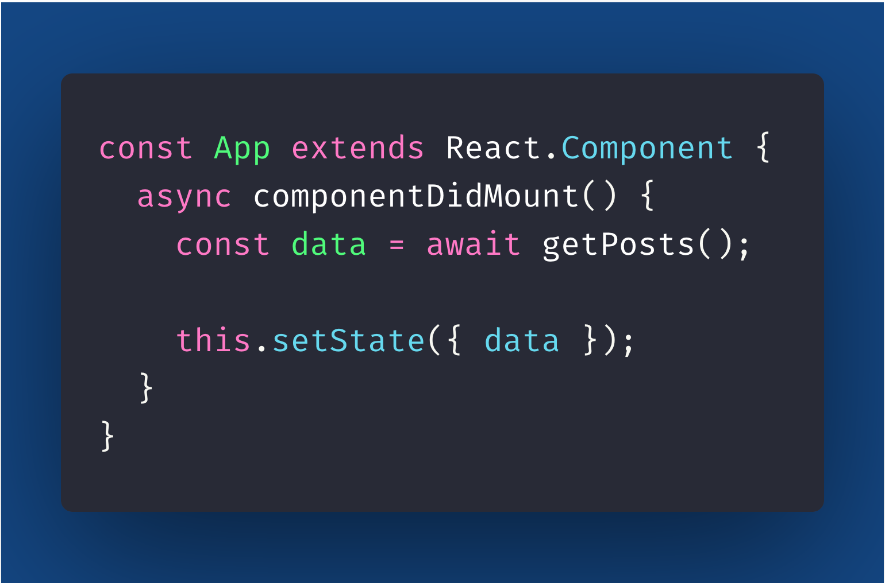
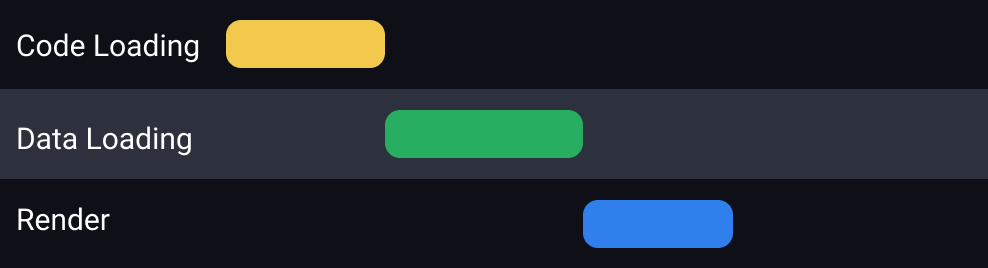
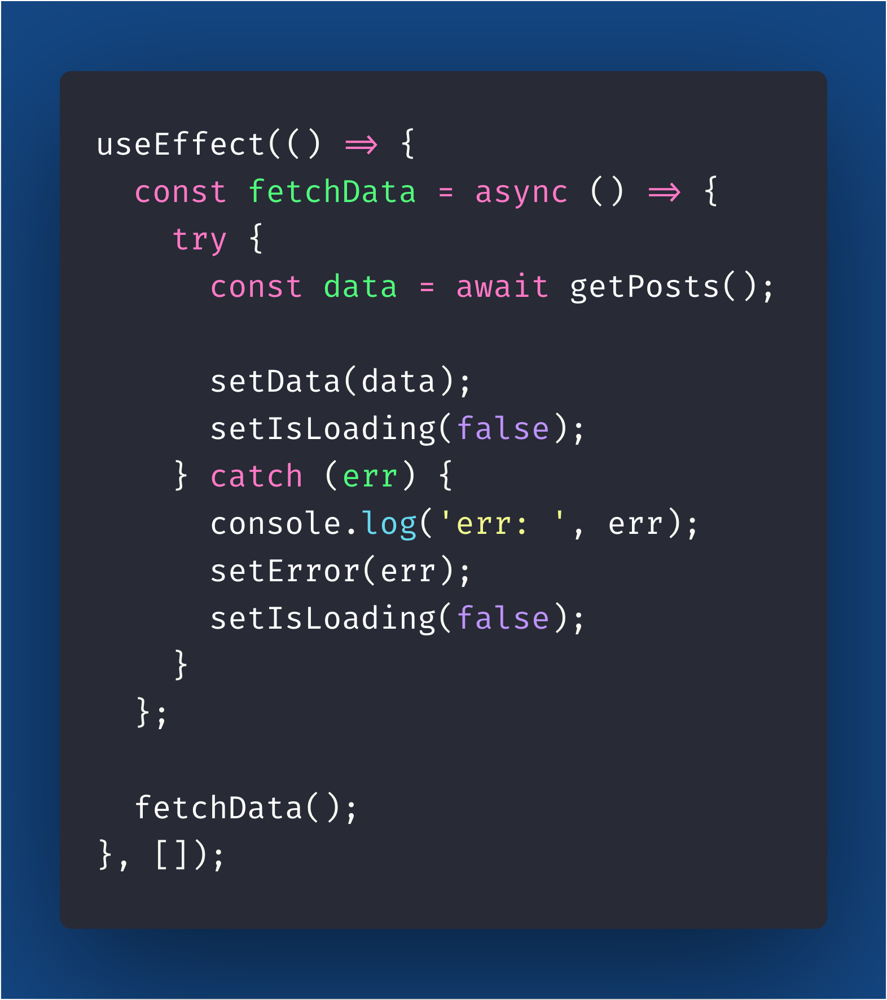
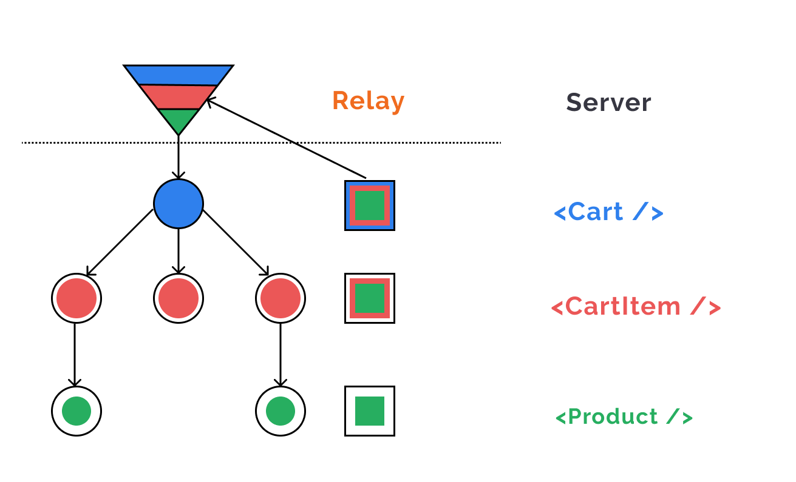
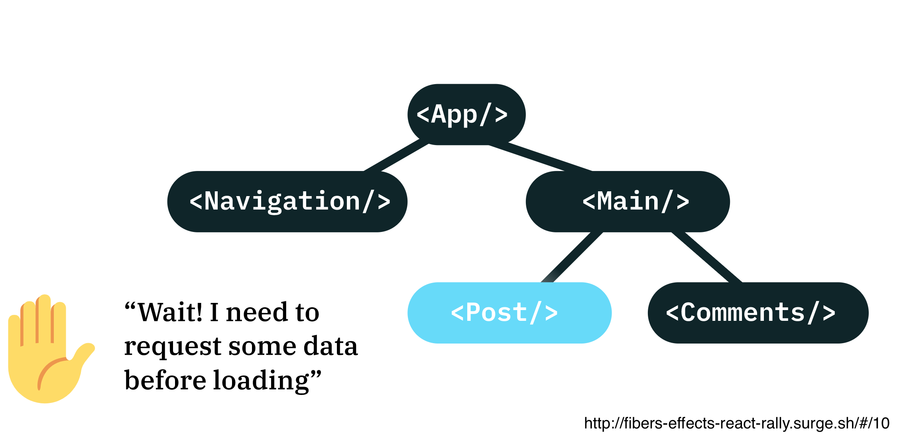
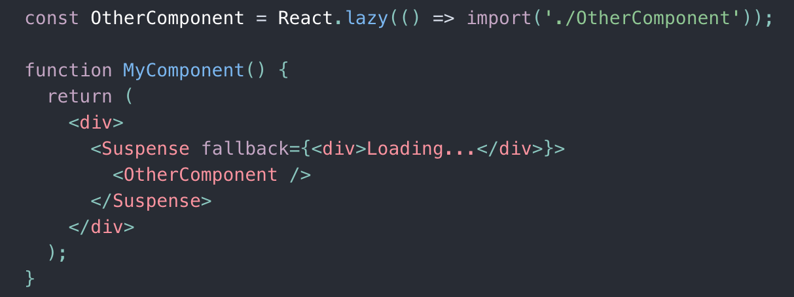
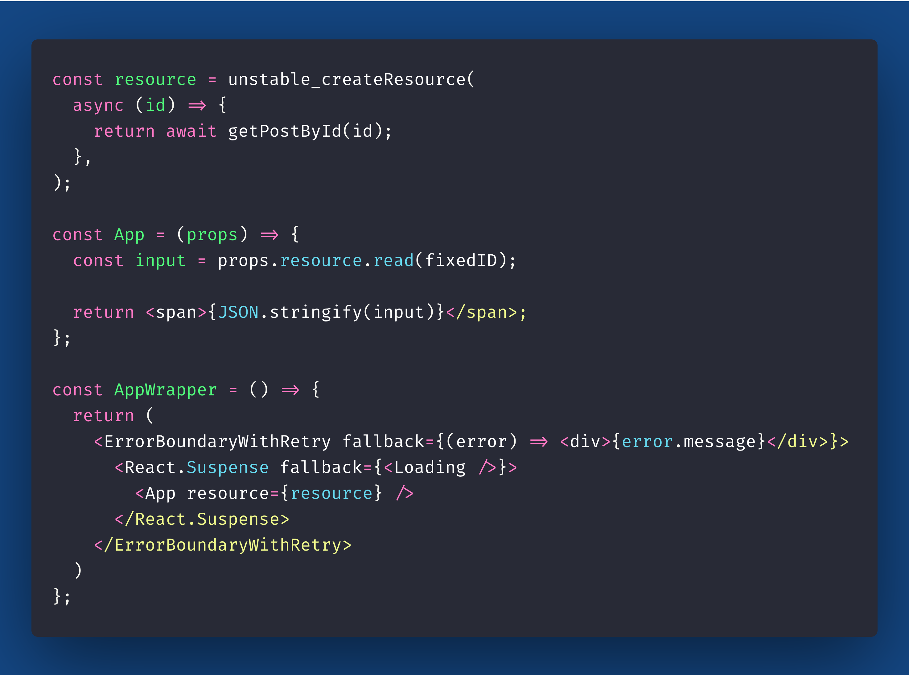
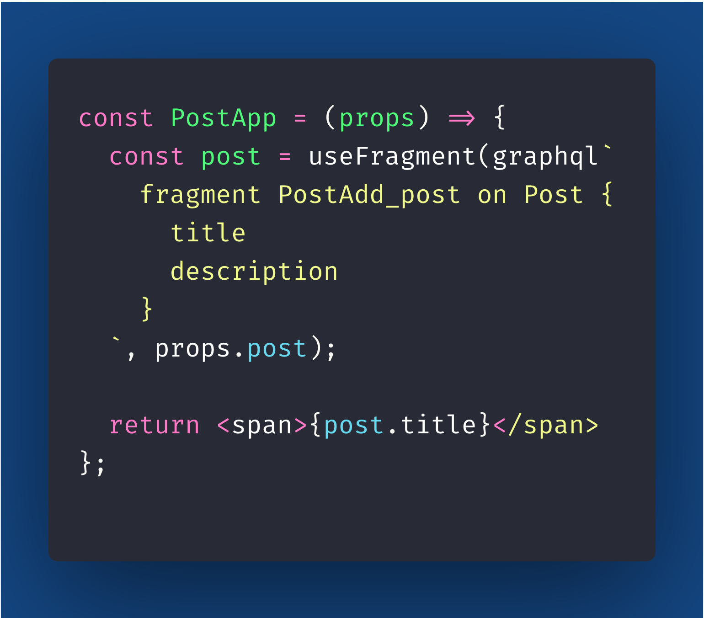

import { Head, Image, Appear } from 'mdx-deck'
import { Split, FullScreenCode } from 'mdx-deck/layouts'
import { CodeSurfer } from "mdx-deck-code-surfer";

import { Cover } from './Cover';
import { Intro } from './Intro';
import { Img } from './Img';
import { InlineImg } from './InlineImg';
import { Thanks } from './Thanks';
import { Feedback } from './Feedback';

export { default as theme } from './theme'

<Head>
  <title>Taming Data Fetching</title>
</Head>

<Cover />

---

<Intro />

---

## Overview

<ul>
    <Appear>
        <li>
            Motivation
        </li>
        <li>
            History/Evolution
        </li>
    </Appear>
</ul>

---

## Motivation

- What is Data Fetching?
- Why do we need Data Fetching?
- Why is it hard?

---

## What is Data Fetching?

- It is the reading/retrieve of data from somewhere
- You can fetch data from local storage (disk) or network storage (server)

---

## Network Data Fetching Example

---

## Why do we need Data Fetching?

- We can't keep all app data in memory
- We can't download all app user data locally
- We just want to fetch the data we are using

---

## Why is it hard?

- We don't want to overfetch (retrieve more data that we need)
- We don't want to underfetch (retrieve less data that we need)
---

## Why is it hard?

- We need to know from where we can get the data we need
- We can have more than one "endpoint" to get the data
- We want to cache data already fetched, so we don't waste network resources
---

## Why is it hard?

- Optimistic Updates
- Offline support
- Local First Architecture
- Realtime

---

## Imperative Data Fetching

- We define step by step how to do the data fetching logic
- We define the endpoints
- We define how to cache/store the data
- We define how to invalidate stale data
- We define when to do data fetching

---

## Imperative Data Fetching

---

## Declarative Data Fetching

- You define the data which components needs
- GraphQL made this pattern possible
- Relay/Apollo makes sure the data is ready when rendering the components

---

## Declarative Data Fetching

---

## History/Evolution

- *componentDidMount*

---

## ComponentDidMount

---

## ComponentDidMount drawbacks
- class api
- data fetching logic spread on component lifecycles
- imperative api
- render then fetch (request waterfall)
- setState on unmounted components

---

## Request Waterfall

- You first fetch code (code split)
- then you fetch data

---

## Request Waterfall

---

## History/Evolution

- componentDidMount
- *Redux Thunk*

---

## Redux Thunk

---

## Redux Thunk drawbacks
- imperative api
- hard to sync loading state with component

---

## History/Evolution

- componentDidMount
- Redux Thunk
- *Redux Saga*

---

## Redux Saga

---

## Redux Saga drawbacks
- same as Redux Thunk

---

## History/Evolution

- componentDidMount
- Redux Thunk
- Redux Saga
- *useEffect hook*

---

## UseEffect

---

## UseEffect drawbacks

- imperative api
- keep state of loading, error, isMounted, fetch cancelling
- hard to handle race conditions

---

## Data Fetching Race Conditions

---

## Why Data Fetching Race Conditions happens?

- network can be slow
- backend could be under heavy load
- user is typing too fast
- you are unlucky
- debounce is not enough

---

## How to "solve" Data Fetching Race Conditions

- ignore responses from former api calls
- cancel former api calls

---

## Custom Hooks for Imperative Data Fetching

- [use-async-effect](https://github.com/n1ru4l/use-async-effect)
- [react-hooks-fetch](https://github.com/dai-shi/react-hooks-fetch)

---

## Custom Hooks for Imperative Data Fetching

- remove some pain points of imperative data fetching
- keep state of loading, error, isMounted and fetch cancelling

---

## History/Evolution

- componentDidMount
- Redux Thunk
- Redux Saga
- useEffect hook
- *Relay HOCs*

---

## Relay HOCs

---

## Relay HOCs

- declarative data fetching
- data components

---

## Relay fragments understanding

---

## Relay HOCs Drawbacks

- HOC API - more "components" in the tree
- render props API to handle loading and error state

---

## History/Evolution

- componentDidMount
- Redux Thunk
- Redux Saga
- useEffect hook
- Relay HOCs
- *Suspense*

---

## Suspense

- React suspense is a way to let components suspend while loading/fetching code or data

---

## Suspense

---

## Suspend on Code Loading

---

## Suspense for Data Fetching

---

## Suspense Resource

---

## Suspense Resource State Machine

---

### Suspense Resource Pseudo Algorithm

- Try to read entry from cache
- If request is pending, throw promise (react will suspend the component)
- If request is reject, throw error (error boundary will catch the error)
- When request promise is resolved react will render again your component
- Go back to first step

---

## Benefits of Suspense

- it only shows Loading indicator when loading/fetch is slow enough
- it "transforms" Async in Synchronous

---

## History/Evolution

- componentDidMount
- Redux Thunk
- Redux Saga
- useEffect hook
- Relay HOCs
- Suspense
- *Relay hooks + Suspense*

---

## Relay Modern Hooks with Suspense

- 2 Resources
- QueryResource to cache Queries
- FramentResource to cache Fragments

---

## useLazyLoadQuery

---

## ErrorBoundaryWithRetry + Suspense Fallback Wrapper

---

## useFragment

---

## useRefetchableFragment

---

## Query Resource Fetch Policy

- store-only
- store-or-network
- store-and-network
- network-only

---

## Query Resource Render Policy

- full
- partial

---

## Benefits of new API

- better fetch and render policies (faster render)
- components suspended based on fragments (instead of waiting full Query to finish)
- less components in the tree (no more HOCs)

---

## Benefits of new API

- less boilerplate (refetchable queries are autogenerated by relay compiler)
- only components that reference a fragment are updated (vs whole tree on apollo/redux)

---

## Should we suspend on Refetch?

<ul>
    <Appear>
        <li>
            It depends
        </li>
        <li>
            Blocking vs Non-Blocking pagination
        </li>
    </Appear>
</ul>

---

## How to control suspend behavior?

---

### What's Next?

- Stable React Suspense Concurrent Mode
- Stable Relay Modern Hooks
- Stable Scheduler APIs
- @defer/@stream GraphQL/Relay

---

## References

- [Distributed State](https://dev.to/mattkrick/distributed-state-101-why-i-forked-facebook-s-relay-1p7d)
- [Linear Publish Queue](https://github.com/mattkrick/relay-linear-publish-queue)
- [Fresh Concurrent React](https://github.com/sw-yx/fresh-concurrent-react/)
- [Suspense and Concurrent Mode](https://dev.to/pomber/about-react-suspense-and-concurrent-mode-21aj)
- [Concurrent Rendering in React - ReactConf 2018](https://www.youtube.com/watch?v=ByBPyMBTzM0&feature=youtu.be&t=1312)
- [Moving To React Suspense](https://www.youtube.com/watch?v=SCQgE4mTnjU)

---

## References

- [Beyond React 16](https://www.youtube.com/watch?v=nLF0n9SACd4)
- [REST hooks](https://resthooks.io/)
- [Poor man's algebraic effects](https://mobile.twitter.com/sebmarkbage/status/941214259505119232)
- [A Complete Guide to useEffect](https://overreacted.io/a-complete-guide-to-useeffect/)
- [Handling API request race conditions in React](https://sebastienlorber.com/handling-api-request-race-conditions-in-react)
- [Building the New Facebook](https://developers.facebook.com/videos/2019/building-the-new-facebookcom-with-react-graphql-and-relay/)
- [Algebraic Effects](http://fibers-effects-react-rally.surge.sh/#/)
- [React Suspense Netlify](https://www.netlify.com/blog/2018/10/18/react-suspense-with-netlify-functions/)

---

## References

- [Local-first Software](https://www.inkandswitch.com/local-first.html)
- [React Relay Offline](https://github.com/morrys/react-relay-offline)
- [Wora - Cache and Offline handling](https://github.com/morrys/wora)
- [useFragment explanation](https://twitter.com/sseraphini/status/1170007939727466496)
- [Automerge](https://github.com/automerge/automerge)

---

## References

- [use-async-effect](https://github.com/n1ru4l/use-async-effect)
- [react-hooks-fetch](https://github.com/dai-shi/react-hooks-fetch)

---

<Thanks />

---

<Feedback />
